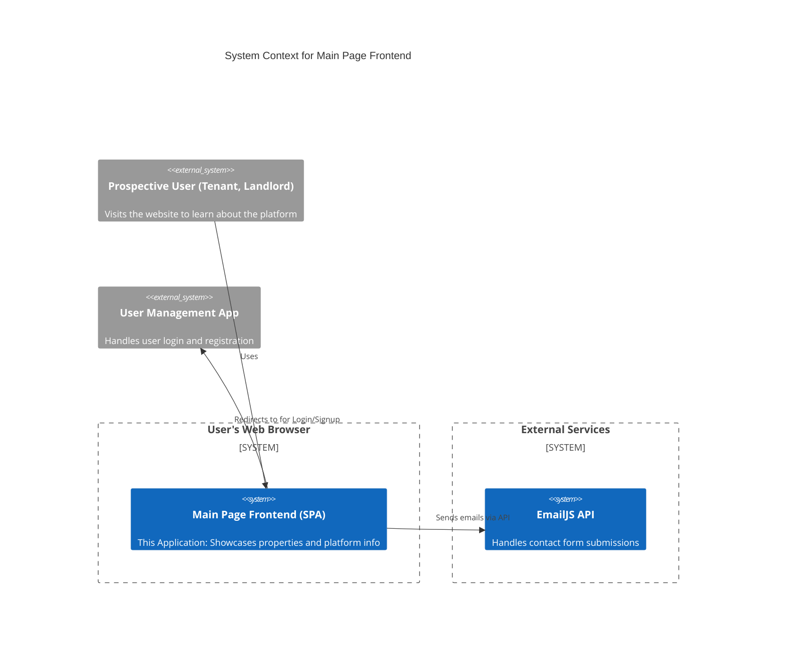

# Rental Main Page Frontend

[](https://opensource.org/licenses/MIT)
[](https://www.typescriptlang.org/)
[](https://reactjs.org/)
[](https://vitejs.dev/)
[](https://tailwindcss.com/)

The Main Page Frontend serves as the public-facing gateway for the Rent Management System. It is a visually-rich, responsive, and informative website designed to attract new users, showcase properties, and provide essential information about the platform.

## Table of Contents
- [Introduction](#introduction)
- [Features](#features)
- [Architecture](#architecture)
- [Design Patterns & Key Concepts](#design-patterns--key-concepts)
- [Technologies Used](#technologies-used)
- [Folder Structure](#folder-structure)
- [Setup Guide](#setup-guide)
  - [Prerequisites](#prerequisites)
  - [Environment Variables](#environment-variables)
  - [Installation](#installation)
  - [Running the Application](#running-the-application)
- [Key Components](#key-components)
- [Styling](#styling)
- [Internationalization (i18n)](#internationalization-i18n)
- [Contributing](#contributing)
- [License](#license)
- [Contact](#contact)

## Introduction
This application is the first point of contact for potential tenants and landlords. It is a Single Page Application (SPA) built with React and TypeScript, focusing on marketing, information dissemination, and user engagement. It highlights the system's value proposition, displays available properties, and guides users toward registration and login. It is optimized for performance and accessibility to ensure a smooth experience for all visitors.

## Features
-   **Multi-Language Support**: Full internationalization (i18n) for English, Amharic, and Oromo to cater to a diverse user base.
-   **Responsive Design**: A mobile-first, fully responsive UI built with Tailwind CSS, ensuring a seamless experience on any device.
-   **Dynamic Content Sections**: Includes sections for About Us, Property Listings (Apartments, Condominiums, Houses), Testimonials, FAQ, and Contact.
-   **Interactive UI/UX**: Engaging animations and transitions using `AOS` (Animate On Scroll) library.
-   **Property Showcase**: Displays various property types with images and descriptions.
-   **Contact Form**: An integrated contact form using EmailJS for direct communication.
-   **Chatbot Integration**: A customer service chatbot for instant user assistance.

## Architecture
This application is a standalone **Single Page Application (SPA)**. It is primarily a static-informational site but includes dynamic features like a contact form and a chatbot. It is designed to be deployed as the main landing page for the entire rental ecosystem.



## Design Patterns & Key Concepts

-   **Component-Based Architecture**: The UI is composed of small, reusable React components, organized logically by feature and page sections.
-   **Context API**: `MyContext` is used for sharing state and functions across the component tree, such as managing the mobile menu's visibility.
-   **Lazy Loading**: Though not explicitly implemented in the current structure, the componentized architecture allows for easy integration of `React.lazy` and `Suspense` to improve initial load times.
-   **Separation of Concerns**: The project structure separates components, data, styles, and internationalization logic into distinct directories.

## Technologies Used
-   **Framework**: [React](https://reactjs.org/) v19, [Vite](https://vitejs.dev/)
-   **Language**: [TypeScript](https://www.typescriptlang.org/)
-   **Styling**: [Tailwind CSS](https://tailwindcss.com/), [Sass](https://sass-lang.com/)
-   **Routing**: [React Router](https://reactrouter.com/)
-   **Internationalization**: [i18next](https://www.i18next.com/), [react-i18next](https://react.i18next.com/)
-   **Animations**: [AOS (Animate On Scroll)](https://michalsnik.github.io/aos/)
-   **Email**: [EmailJS](https://www.emailjs.com/)
-   **Linting/Formatting**: ESLint

## Folder Structure
The `src` directory is organized to maintain a clean and scalable codebase.
```
src/
├── components/        # Reusable React components
│   ├── Home/          # Components specific to the main page sections
│   ├── Chatbot.tsx    # Chatbot component
│   ├── Contact.tsx    # Contact form component
│   ├── Footer.tsx     # Application footer
│   └── ...
├── context/           # React context providers (e.g., MyContext)
├── data/              # Static data, such as property information
├── style/             # Global and shared style files
├── types/             # TypeScript type definitions
├── App.tsx            # Main application component with routing
├── i18n.ts            # Configuration for i18next
├── main.tsx           # Application entry point
└── index.css          # Global styles and Tailwind CSS imports
```

## Setup Guide

### Prerequisites
-   Node.js (v18.x or higher)
-   `npm` or `yarn`

### Environment Variables
This project uses EmailJS for the contact form. You will need to create a `.env` file in the root directory with your EmailJS credentials.

```
# .env

# Your EmailJS Service ID
VITE_EMAILJS_SERVICE_ID="your_service_id"

# Your EmailJS Template ID
VITE_EMAILJS_TEMPLATE_ID="your_template_id"

# Your EmailJS Public Key (User ID)
VITE_EMAILJS_USER_ID="your_public_key"
```

### Installation
1.  **Clone the repository**:
    ```bash
    git clone https://github.com/rent-management-system/Main-page-frontend.git
    cd Main-page-frontend
    ```

2.  **Install dependencies**:
    ```bash
    npm install
    ```

### Running the Application
1.  **Start the development server**:
    ```bash
    npm run dev
    ```
    The application will be available at `http://localhost:5173` (or another port if 5173 is busy).

2.  **Build for production**:
    ```bash
    npm run build
    ```
    The production-ready files will be generated in the `dist/` directory.

3.  **Lint the code**:
    ```bash
    npm run lint
    ```
    This command checks the codebase for any linting errors.

## Key Components
-   **`App.tsx`**: The root component that sets up the application's routing structure using `react-router-dom`.
-   **`Home.tsx`**: The main landing page component, which aggregates all the different sections like `FrontPage`, `AboutSection`, `Products`, etc.
-   **`Header.tsx`**: The main navigation bar, which includes the language switcher and navigation links.
-   **`Contact.tsx`**: A form that captures user inquiries and sends them to a pre-configured email address using EmailJS.
-   **`Chatbot.tsx`**: An integrated chatbot component for providing real-time assistance to users.
-   **`PropertiesPage.tsx`**: A dedicated page to browse and view details of all available properties.

## Styling
The project uses a hybrid styling approach:
-   **Tailwind CSS**: For utility-first styling, enabling rapid and consistent UI development. Configuration is in `tailwind.config.js`.
-   **Sass/SCSS**: For more complex, component-specific styles that are harder to manage with utility classes alone. See `src/style.scss`.
-   **CSS Modules/Plain CSS**: For component-level encapsulation and global styles. See `App.css` and `Chatbot.css`.

## Internationalization (i18n)
The application supports multiple languages using the **i18next** library.
-   **Configuration**: The main setup is in `src/i18n.ts`.
-   **Translation Files**: JSON translation files are located in `public/locales/{language}/translation.json`.
-   **Usage**: The `useTranslation` hook from `react-i18next` is used within components to access translated strings.

## Contributing
Contributions are what make the open-source community such an amazing place to learn, inspire, and create. Any contributions you make are **greatly appreciated**.

This project is developed and maintained by:
-   [Dagmawi Teferi](https://github.com/dagiteferi)
-   [Abeni Tilahun](https://github.com/Abeni5)
-   [Nehmya Biruk](https://github.com/Nehmyabiruk)

A special thanks to **Fiyameta** ([@meba210](https://github.com/meba210)) for the invaluable UI review and updates.

To contribute:
1.  Fork the Project
2.  Create your Feature Branch (`git checkout -b feature/AmazingFeature`)
3.  Commit your Changes (`git commit -m 'Add some AmazingFeature'`)
4.  Push to the Branch (`git push origin feature/AmazingFeature`)
5.  Open a Pull Request

## License
This project is licensed under the MIT License. See the `LICENSE` file for more information.

## Contact
Dagmawi Teferi - [dagiteferi2011@gmail.com](mailto:dagiteferi2011@gmail.com)

Project Link: [https://github.com/rent-management-system/Main-page-frontend](https://github.com/rent-management-system/Main-page-frontend)